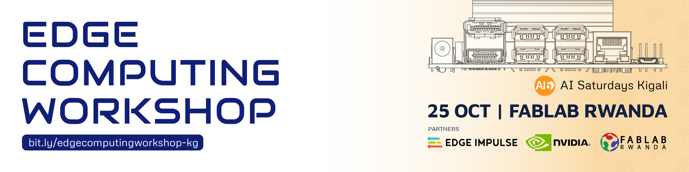
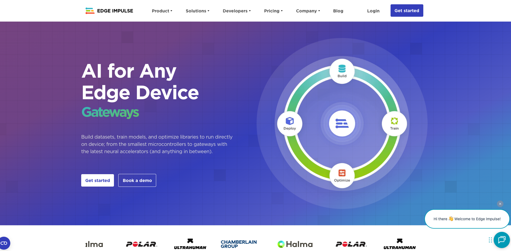
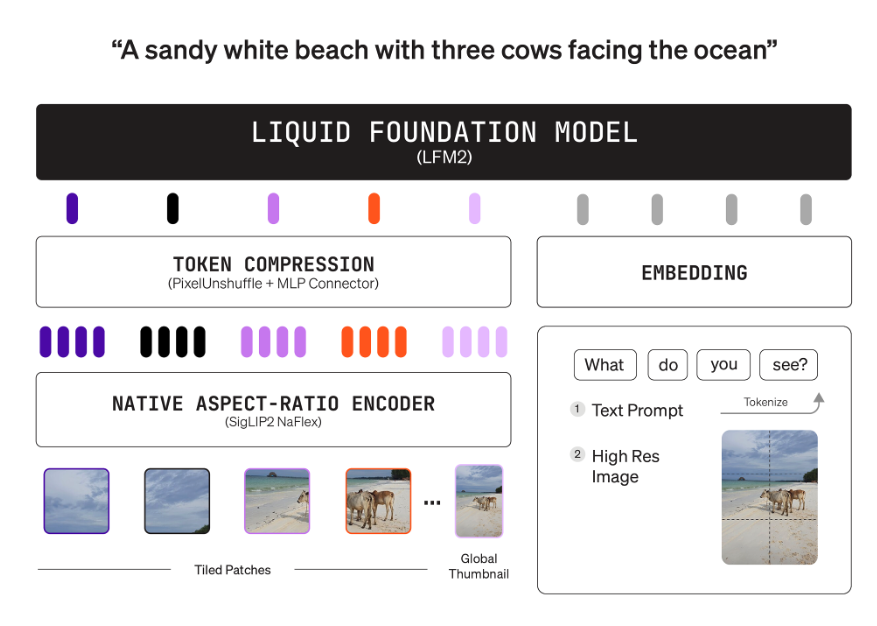
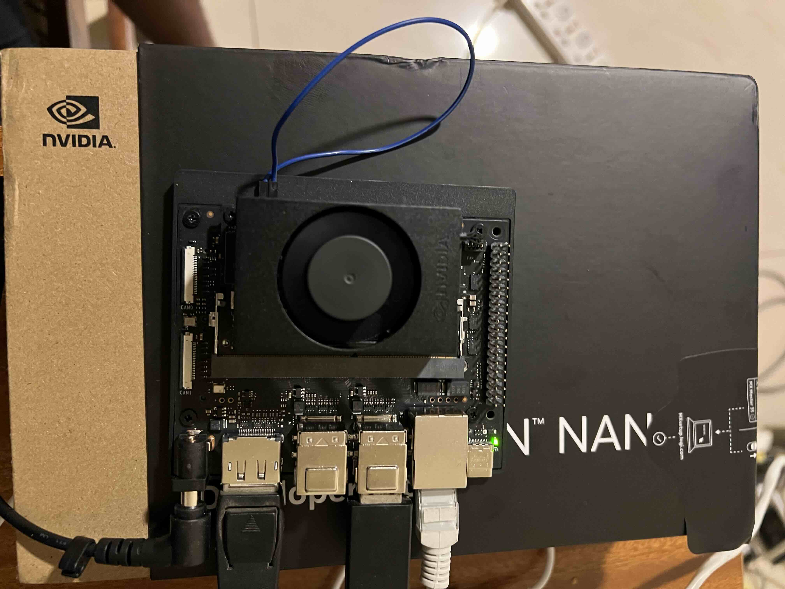

# Edge Computing Workshop Kigali 2025



Slide - [Link](https://docs.google.com/presentation/d/1E56lccdfK-RObEJX98kK9nOLPP6bARF_jRshlebHVts/edit?usp=sharing) 


### Introduction to Edge Impulse: 8 - 11



### Getting Started with Edge Impulse: 12 - 18 


### Collecting Data 
<!--  -->
- Image Classification 
- Object Detection 

### Building Model for Image Classification: 23 - 30
<!--  -->

### Deployment of Image Classification Models Edge Devices and Laptop 
<!--  -->

- Create a python virtual environment 
```
python -m venv edge-env
```

- Activate the environment
```
source edge-env/bin/activate
(edge-env) george@Georges-MacBook-Pro edge-computing-workshop-kigali % 
```

- Install the requirements
```
pip install -r requirements.txt
```

- Change the directory to `image-classification`
```
cd image-classification
```
- Inference on live video stream from camera (Unoptimized Model - float 32): 
```
(edge-env)python3 camera_infer_h5.py -m models/model.h5 -l label.txt --width 320 --height 320 
```
- Inference on live video stream from camera (Optimized Model - int-8): 
```
python camera_infer_tflite.py --model models/ei-edge-computing-workshop-2025-image-classification-classifier-tensorflow-lite-int8-quantized-model.3.lite --labels labels.txt --camera 0 --top_k 3
```

- Inference on images saved on disk: 
```
python batch_infer_images.py --model models/ei-edge-computing-workshop-2025-image-classification-classifier-tensorflow-lite-int8-quantized-model.3.lite --labels labels.txt --images_dir ./sample-directory
```

### Working with Visual Language Models(Liquid AI - VLM) 
<!--  -->

```
python camera_infer_tflite.py --model models/ei-edge-computing-workshop-2025-image-classification-classifier-tensorflow-lite-int8-quantized-model.3.lite --labels labels.txt --camera 0 --top_k 3
```

Quit
```
^CTraceback (most recent call last):
  File "/Users/george/Documents/github/edge-computing-workshop-kigali/image-classification/camera_infer_tflite.py", line 162, in <module>
    main()
  File "/Users/george/Documents/github/edge-computing-workshop-kigali/image-classification/camera_infer_tflite.py", line 154, in main
    key = cv2.waitKey(1) & 0xFF
          ^^^^^^^^^^^^^^
KeyboardInterrupt
^C
```

```
```


### Prompt Engineering on Visual Language Model (VLM) 

Prompting Visual Language Model (VLM) Colab - [VLM Prompt Engineering](https://colab.research.google.com/drive/1uMbCadRY-ILQtsJ5DS2l1qAYWNMg_Kv9?usp=sharing)

### Deploying VLM on Edge Device 


- Change directory into `visual-language-model`
  ```
  python3 deployment-script.py
  ```
- 

## Reference 
- [Edge Impulse]()
- [Edge Impulse with Tensorrt Jetson](https://docs.edgeimpulse.com/tools/libraries/sdks/inference/linux/cpp#tensorrt)
- [Image Classification]()
- [Edge Impulse Linux CLI](https://docs.edgeimpulse.com/tools/clis/edge-impulse-linux-cli#edge-impulse-linux-runner)
- [Edge Impulse Linux SDKs](https://docs.edgeimpulse.com/tools/libraries/sdks/inference/linux)
- [Edge Impulse NVIDIA Jetson](https://docs.edgeimpulse.com/hardware/boards/nvidia-jetson)
- [venv — Creation of virtual environments](https://docs.python.org/3/library/venv.html)
- [Object Detection]()
- [Visual Language Model - VLM]()
- [Inference with Qualcomm AI Accelerator on Particle Tachyon](https://www.hackster.io/naveenbskumar/inference-with-qualcomm-ai-accelerator-on-particle-tachyon-1c8888?f=1)
